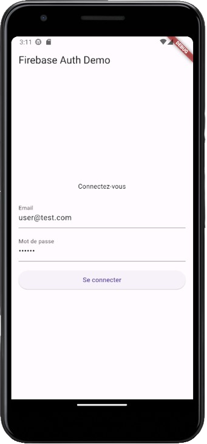
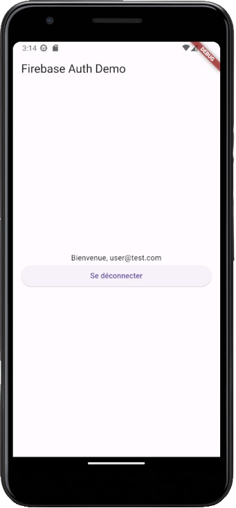

# FlutterFirebaseAuth

This is a Flutter project created for demonstrating Firebase Authentication using the `firebase_auth` package.




## Creating a Firebase Project

1. **Connect to Firebase Console:**

   - Log in with your Google account at [Firebase Console](https://console.firebase.google.com/).

2. **Add a Project**

3. **Project Homepage**

   - After clicking "Continue", the project homepage should be displayed.

## Configuring Firebase with Flutter

1. **Install Firebase CLI:**

   - Install Firebase CLI globally using npm.
   ```bash
   npm i -g firebase-tools
   ```

2. **Add `npm` Folder to `PATH`:**

   - Add the `npm` directory to the environment variable `PATH`. (on Windows: `C:\Users\UserName\AppData\Roaming\npm`)
   - Note: if you're using `nvm` the `npm` version directory which has `firebase-tools` installed globally may be within the `nvm` directory.
  
3. **Run Firebase Login:**

   - Run `firebase login` from the command line and log in with your Google account.

4. **Execute Firebase and NPM Commands:**

   - Once logged in, you can execute `firebase` and `npm` commands from this console. For example, you can run `firebase projects:list` to view created projects.

5. **Install FlutterFire CLI:**

   - Install FlutterFire CLI globally. If a warning is displayed, add the suggested path to the `PATH`.
   ```bash
   dart pub global activate flutterfire_cli  
   ```

## Creating an authentication demo app

1. **Create a New Flutter Application:**

   - Create a new Flutter application.
   ```bash
   flutter create your_app_name
   ```

2. **Add Dependencies:**

   - Add the dependencies: `firebase_core` and `firebase_auth`.
   ```bash
   flutter pub add firebase_core firebase_auth
   ```

3. **Configure Firebase:**

   - From the application directory, run the command: `flutterfire configure`.
   - Note: if you're using VS Code and this command doesn't work from the VS Code terminal, attempt to restart the code editor or run the command from your OS terminal.

4. **Select Firebase Project**

5. **Configure Platforms**

   - Select the platform(s) to configure (e.g., Android, iOS, macOS, and web) and press "Enter". Use the "Space" key to toggle selection.

   - This command creates an application for each platform in the Firebase project.

## Initializing Firebase

1. **Add Firebase Initialization:**

   - In the `main()` function, add `await Firebase.initializeApp()` and make the function asynchronous.
   ```dart
   Future<void> main() async {
      WidgetsFlutterBinding.ensureInitialized();
      await Firebase.initializeApp(options:DefaultFirebaseOptions.currentPlatform);
      runApp(const MainApp());
   }
   ```

   - The added imports should include:
   ```dart
   import 'package:firebase_core/firebase_core.dart';
   import 'firebase_options.dart';
   ```

## Configuring Authentication in Firebase Console

1. **From Firebase Project Homepage:**

   - Click on the "Authentication" card and then click "Get Started".

2. **Sign-in Method:**

   - In the "Sign-in method" tab, click on "Email/Password" under "Enabled Providers".

3. **Enable Email/Password:**

   - Check the "Email/Password" box and click "Save".

4. **Add a test user**

   - Navigate to the "Users" tab and click "Add user".

## Configuring Authentication Page

1. **Add Dependency:**

   - Add the dependency: `firebase_ui_auth`.
   ```bash
   import 'package:firebase_ui_auth/firebase_ui_auth.dart';
   ```

2. **Add ``EmailAuthProvider``:**

   - Add `EmailAuthProvider` to the `main()` function.
   ```dart
   Future<void> main() async {
      WidgetsFlutterBinding.ensureInitialized();
      await Firebase.initializeApp(options:DefaultFirebaseOptions.currentPlatform);
      FirebaseUIAuth.configureProviders([
         EmailAuthProvider(),
      ]);
      runApp(const MainApp());
   }
   ```
   - The added import should include:

   ```dart
   import 'package:firebase_auth/firebase_auth.dart';
   ```

## Login Screen Widget

1. **Add Your Login Screen Widget:**

   - Add a login screen widget (`StatelessWidget`) with an appropriate file.

2. **Build Method:**

   - In the `build` method of the widget, return a `StreamBuilder` of type `User` (nullable).

3. **Stream Property:**

   - Set the `stream` property to `FirebaseAuth.instance.authStateChanges()`.

4. **Builder Property:**

   - Set the `builder` property to `(context, snapshot) => Container()`.

5. **Display User Information:**

   - In the `Container` widget, display user information from `snapshot.data`, and a button to sign out (`FirebaseAuth.instance.signOut()`).

6. **Display Login Form:**

   - Add code to display the login form when the user is not connected.

## Version Used

**Firebase CLI:** v13.0.2

**FlutterFire CLI**: v0.2.7

**Flutter:** v3.16.3

**Dart:** v3.2.3

**NPM:** v10.2.5

